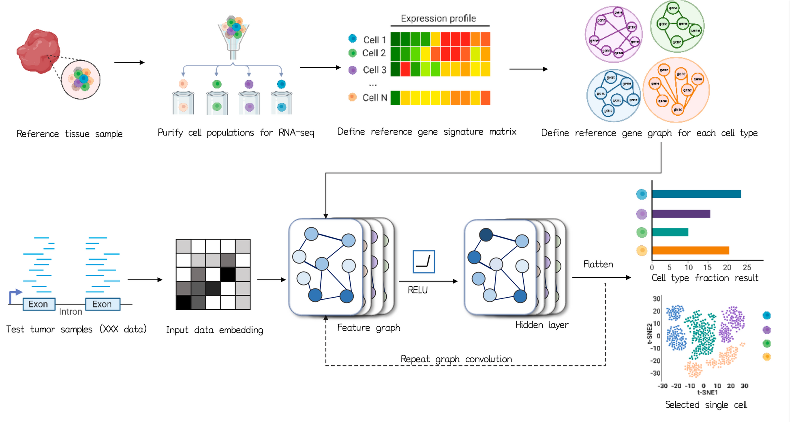

# Welcome to CytoBulk documentation!

## CytoBulk Library



The Python module CytoBulk is a self-contained machine learning framework. 


## How to install CytoBulk

You can install CytoBulk from PyPI:
```bash
pip install CytoBulk
```

## How to use CytoBulk
