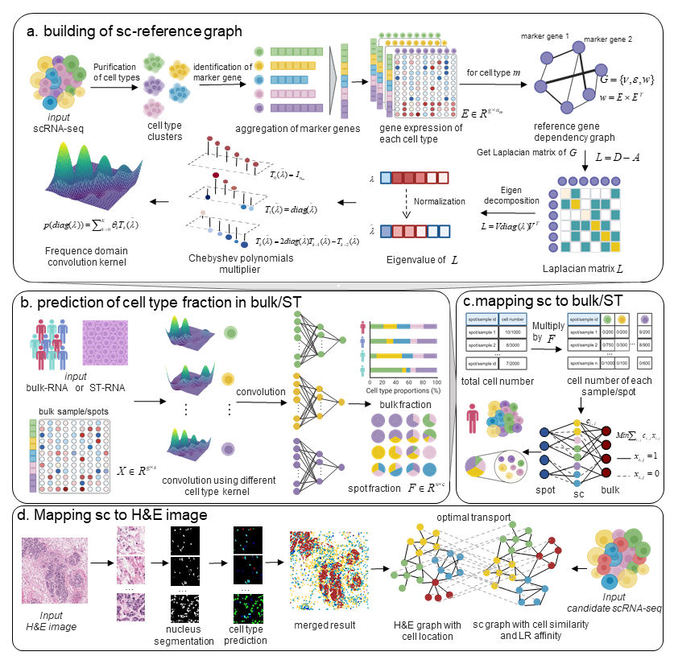

# Welcome to CytoBulk documentation!

## CytoBulk Library

A tool that integrates bulk RNA, single-cell RNA (scRNA), spatial transcriptome (ST), and H&E images to deconvolute the TIME from bulk or spot data using graph frequency domain modeling; and reconstructs the TIME to single-cell resolution using optimal transport methods.

